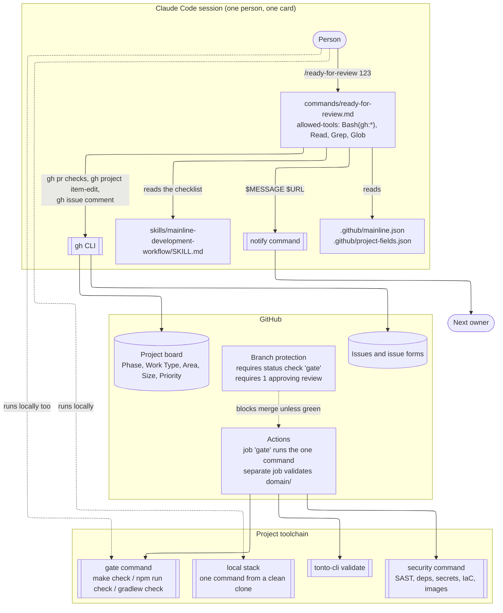
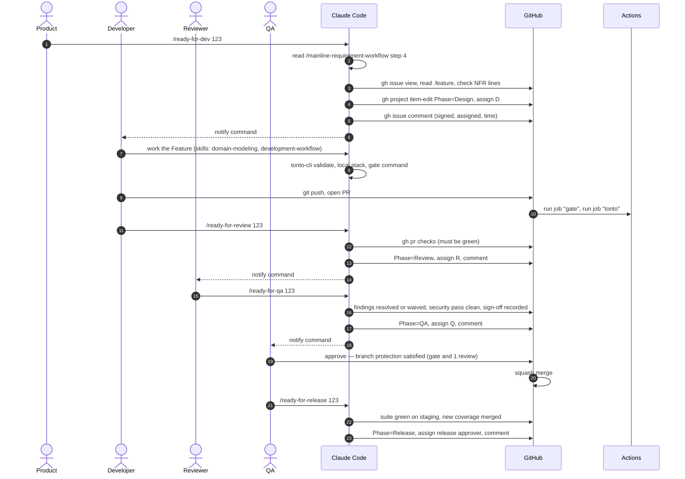

# How Mainline is built

For the curious: what Mainline is made of, where each rule is actually enforced, and what it
deliberately does not use. Read `playbook/00-overview.md` first for what the line *is*; this
document is about the machinery underneath it.

## The short version

Mainline is three layers, and each rule in the playbook lives in exactly one of them:

| Layer | What it is | What it enforces |
|---|---|---|
| **Claude Code, inside a session** | Skills (`.claude/skills/`) and slash commands (`.claude/commands/`). Markdown files the agent reads and follows. | Procedure. How a station is worked, what a handoff checks, in what order. |
| **GitHub, between sessions** | The Project board, issues and issue forms, branch protection, Actions. | State and the merge boundary. Where work is, who holds it, and that nothing merges without a green gate and a second person. |
| **The project's own toolchain** | The gate command, the security command, the local stack, `tonto-cli`, the `notify` command. | Facts about the code. Tests pass, thresholds hold, boundaries are respected, the system runs. |

Mainline uses **no Claude Code hooks**. Everything the agent does inside a session is driven by
prompts (skills and commands) and by ordinary tool calls, almost all of them to the `gh` CLI. The
binding checks are placed one layer down, at GitHub and in CI, where they apply to every path into
the repository and not only to a Claude Code session. The section "Why no hooks" explains the
trade-off and where hooks would fit if they were added.

## The pieces



*Everything inside the session is a prompt the agent follows. Everything at GitHub and in the
toolchain is a program that runs the same way regardless of who or what triggered it.*

### Skills: `skills/*/SKILL.md`

A skill is a Markdown procedure for one station. It is copied into a project's `.claude/skills/`
and loaded into the agent's context when the agent decides it applies (from the `description` in
the frontmatter) or when a command tells it to read one. Skills carry the checklists; commands do
not restate them, so there is one place to change a check.

A skill cannot enforce anything. It can tell the agent to run the gate command and to stop if it is
red; it cannot stop the agent by itself. Where a skill's rule must hold no matter what, the rule is
duplicated as a tool in one of the other two layers (see the enforcement table below).

Some skills carry reference material in a `references/` folder: the Tonto language guide and
derivation rules for `/mainline-domain-modeling`, the charter template, issue forms and example gate
workflow for `/mainline-pmi-github-project`, the observation-log and discovery-record templates for
`/mainline-product-discovery`.

### Commands: `commands/ready-for-*.md`

A command is a slash command: a Markdown prompt with frontmatter. The frontmatter restricts what the
agent may do while running it:

```yaml
allowed-tools: Bash(gh:*), Read, Grep, Glob
```

`allowed-tools` pre-approves those tools for the command. Anything outside the list, such as the
`notify` shell command, is not blocked outright but falls back to the session's normal permission
prompt, so it interrupts the person on every handoff unless it is listed. Within that envelope the
command does five things in
order and stops at the first failure: run the station's checks, block and name the failure, move
`Phase`, assign the next owner, notify them and record the result as an issue comment.

The checks themselves are read from the station's skill at run time. The command tells the agent
where the checklist is and what evidence satisfies each line; it does not carry the checklist.

### Configuration: two JSON files in the project

Both files are written by `/wire-handoffs` and verified by `/wire-handoffs --check`.

- `.github/mainline.json` holds the board parameters (owner, repository, project number and ID),
  the `notify` command, and the default assignee per station. `notify` is a shell command taking
  `$MESSAGE` and `$URL`, so the transport (Slack, Teams, email, a webhook) is a one-line swap and the
  commands do not know which it is.
- `.github/project-fields.json` caches the board's field and option IDs. Fetching them on every
  call is slow and trips GitHub's secondary rate limit; a stale ID fails loudly, which is the good
  failure mode.

### GitHub: the board, the forms, the protection, the workflow

`/mainline-pmi-github-project` stands this up once with `gh`:

- **Project board** with custom fields. `Phase` is the station the work is at, and only the handoff
  commands are supposed to change it. `Work Type` is Epic, Feature, Risk, Refactor, Spike, Bug, Chore
  or Platform.
- **Issue forms** (`references/issue-templates/*.yml`) that require the fields the board needs. A
  risk cannot be filed without its statement, trigger and response.
- **Branch protection** on the default branch: squash-only, delete on merge, the `gate` status
  check required, one approving review required. This is the merge boundary, and it is the one
  place a rule holds against every client: a person in an IDE, an agent in a session, a script.
- **Actions**: a `gate` job that runs the project's single gate command on every pull request
  (`references/gate.yml` is the example), and a separate job that validates the Tonto model. The
  domain-model check is kept out of the gate command on purpose: the gate binds only on tools whose
  failure always means the code is wrong, and coupling it to a single-maintainer 0.4.x tool would
  put the gate's authority at the mercy of an upstream regression.

### The project's toolchain

Mainline defines what each check must prove, not which program proves it. Every project calibrates:

- **One gate command** (`make check`, `npm run check`, `./gradlew check`) that runs the seven
  quality dimensions and exits non-zero on any failure. Local runs and CI run the same command.
- **One security command** for the DevSecOps dimensions, with today's findings baselined with
  dates and owners so that only new findings block.
- **One local stack command** that starts the whole system from a clean clone with no cloud
  credentials, using LocalStack or an equivalent for cloud services.
- **`tonto-cli`** for the domain model, pinned at 0.4.13 on Node 20 or later.
- **A rewrite engine** for `/mainline-refactoring` (OpenRewrite, Roslyn, ts-morph, and so on).

## Where each rule is enforced

The playbook states rules in one voice. The machinery behind them is not uniform, and it is worth
knowing which kind you are relying on.

| Rule | Mechanism | Hard or soft |
|---|---|---|
| Nothing merges with a red gate | Branch protection requires the `gate` status check | **Hard.** Holds for every client. |
| Every change is reviewed by a second person | Branch protection requires one approving review | **Hard.** |
| The gate is one command, same locally and in CI | The Actions job runs the calibrated command | **Hard**, once calibrated. |
| The domain model still validates | Separate Actions job running `tonto-cli validate` | **Hard.** Fails independently of the gate. |
| No production module imports `prototypes/` | An architecture rule in gate dimension 2 | **Hard**, once the rule is written. |
| A handoff refuses to move work past a failing check | The `/ready-for-…` command's prompt: check, then block | **Soft.** The agent obeys the prompt; a person can still run `gh project item-edit` directly. |
| Only handoff commands change `Phase` | Convention | **Soft.** GitHub Projects has no field-level permission. |
| Reviewer is never the author | `/ready-for-review` stops if the only candidate is the author | **Soft** in the command; **hard** at merge, since GitHub does not count the author's own approval. |
| Findings are filed before the session ends | `/mainline-file-finding`, called from other skills | **Soft.** |
| Never lower a threshold to pass | Stated in every skill that touches the gate | **Soft** in the session; a lowered threshold is visible in the PR diff, so Review catches it. |
| The notify message landed | The `notify` command's exit status; the commands say so when it is unset | **Soft.** The command reports, it does not verify delivery. |

The pattern: **anything that gates a merge is hard; anything that moves a card or asks the agent
to behave is soft.** The soft rules are still worth having. They are what makes the ordinary path
work without friction, and the hard rules are what makes the extraordinary path (someone bypassing
a command) fail safe.

## Why no hooks

Claude Code hooks are shell commands the harness runs at fixed points in a session: before or after
a tool call, when the agent stops, when a session starts. They are the one mechanism that could
make an in-session rule hard: a `PreToolUse` hook can refuse a `gh project item-edit` that touches
`Phase` outside a handoff command, and a `Stop` hook can refuse to end a session while the gate is
red.

Mainline does not use them today, for three reasons:

1. **Enforcement was placed at the merge boundary on purpose.** Branch protection and CI apply to
   every path into the repository. A hook applies only to a Claude Code session, so a rule enforced
   by a hook is not enforced for a person using another editor, another agent, or a terminal. The
   rules that must never break were put where they cannot be bypassed by choosing a different
   client.
2. **Skills and commands were kept portable.** They are Markdown and `gh` calls, and they run the
   same way from any project that can run `gh`. Hooks are configured per machine or per project in
   `settings.json`, and they are the first thing that drifts between one developer's setup and
   another's.
3. **Nothing has been run end to end yet.** The playbook was drafted 2026-08-25 and onboarding
   step 8 is the first real test. Adding hooks before knowing which soft rules actually get broken
   would be guessing at the failure mode.

The playbook's own rule cuts the other way: *if a check can be a tool, it is a tool.* Several soft
rules above could become hard with a hook, and the improvement loop is the right place to decide
which. Candidates, in rough order of value:

| Soft rule today | Hook that would make it hard |
|---|---|
| Only handoff commands change `Phase` | `PreToolUse` on `Bash`: refuse `gh project item-edit` calls that set the `Phase` field unless invoked from one of the four `/ready-for-…` commands |
| Run the gate continuously during Build | `PostToolUse` on `Edit` and `Write`: run the gate command (or its fast subset) and surface the result |
| Findings are filed before the session ends | `Stop`: scan the transcript for unfiled findings and refuse to stop until they are filed or explicitly dismissed |
| The agent knows which card it is working | `SessionStart`: read `.github/mainline.json`, find the card assigned to this person in the current `Phase`, and load it |
| Never lower a threshold to pass | `PreToolUse` on `Edit`: refuse edits to the gate's threshold configuration outside a `Platform` branch |

When one of these is adopted, it is `Platform` work: it enters at Inbox, is filed with an owner and
a date, and the escape that motivated it is recorded in the ledger. The hook configuration would
ship in this repository next to `commands/`, so that it is copied into a project the same way.

## The life of one Feature, in tool calls



*Every arrow into GitHub is a `gh` call the command makes. The two arrows the person makes directly
(push, approve) are the ones branch protection guards.*

## Files and what they are for

| Path | Role |
|---|---|
| `playbook/` | The process, for people. Six documents. |
| `skills/<name>/SKILL.md` | One procedure per station, for the agent. Copied to `.claude/skills/`. |
| `skills/<name>/references/` | Templates, language guides and example workflows a skill points at. |
| `commands/ready-for-dev.md`, `ready-for-review.md`, `ready-for-qa.md`, `ready-for-release.md` | The four handoff commands. Copied to `.claude/commands/`. |
| `commands/wire-handoffs.md` | Onboarding step 4: finds the board, caches field IDs, proposes owners and a notify command, writes the config. |
| `commands/README.md` | The contract every command follows, and the two config files. |
| `skills/mainline-help/SKILL.md` | The front desk: where your work is, what to do next, which command runs it. |
| `.github/mainline.json` *(in the project)* | Board parameters, `notify` command, default assignees. |
| `.github/project-fields.json` *(in the project)* | Cached field and option IDs. |
| `.github/workflows/gate.yml` *(in the project)* | The `gate` job branch protection requires. |
| `domain/` *(in the project)* | The Tonto model the design is derived from. |
| `prototypes/` *(in the project)* | Quarantined throwaway prototypes. Outside the build, CI and coverage. |
| `docs/mainline-assessment.md`, `docs/discovery/*.md`, `docs/escape-ledger.md` *(in the project)* | The written records the line produces. |

## What is not here

- **No server, no daemon, no database of its own.** State lives in GitHub. If GitHub is down, the
  line is down.
- **No orchestrator.** Nothing routes work between agents. A person runs a command; the command
  moves one card one step. Multi-agent orchestration was discussed and deferred until the
  single-agent line has been run for real.
- **No hooks**, as above.
- **No client or individual names.** Stories from real engagements are told without the account.
