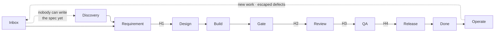

# Mainline

How a project is run end to end — product to production — with humans, agents, and tools, and how any
project gets onboarded onto it.

Mainline is three things:

- **`playbook/`** — the process. Stations, handoffs, roles, and an eight-step onboarding checklist.
- **`skills/`** — the tooling. Agent skills copied into a project and calibrated to its stack, one per
  station.
- **`commands/`** — the four handoff commands, which move work between people and refuse to move it
  past a failing check.

## Start here

| | |
|---|---|
| [`playbook/00-overview.md`](playbook/00-overview.md) | The idea, in one page. |
| [`playbook/01-onboarding.md`](playbook/01-onboarding.md) | Eight steps to get a project onto Mainline. |
| [`skills/README.md`](skills/README.md) | The skill library, indexed by station. |
| [`commands/README.md`](commands/README.md) | The four handoff commands and their config. |
| [`ARCHITECTURE.md`](ARCHITECTURE.md) | How Mainline is built: the three layers, where each rule is enforced, and why there are no hooks. |

## The line

Four handoffs — the only places work changes hands, and so the only places that need a check, a
signature, an assignment, and a notification.

## Layout

| Path | What it is |
|---|---|
| `playbook/` | The process. Five documents. |
| `skills/` | The skill library. Copy into a project's `.claude/skills/`. |
| `commands/` | The four handoff commands. Copy into a project's `.claude/commands/`. |

Nothing in this repo names a client or an individual, and it should stay that way. When a story from
a real engagement is worth telling, tell it without the account — the lesson survives, the exposure
does not.

## Provenance

The skills began as [`SpryElephant/spry-forge`](https://github.com/SpryElephant/spry-forge) and are
maintained here. Forge specified Requirement → Design → Build → Gate for a solo engineer; Mainline
adds the handoffs between people and the four stations after merge. See `skills/README.md` for the
full list of changes.

## Status

Drafted 2026-08-25. Unreviewed by the team, and not yet run end to end on a real project —
onboarding step 8 is the only thing that actually tests any of this.
