# Mainline — the one page

## The idea

A project on Mainline runs on a **line**: work enters at one end, moves through named stations, and
leaves as software in production. Each station has one owner, one job, and one way of doing it. Each
place where work changes hands has a check that runs before it moves.

The end state is **the appropriate use of humans, agents, and tools** at every station:

- **Tools** are deterministic — the gate command, the validator, CI. If a check can be a tool, it is
  a tool. Never ask a person or an agent to eyeball what a tool can prove.
- **Agents** do the work — drafting requirements, deriving the design, implementing, reviewing.
- **People** decide and sign. Priority, ambiguity, what the client actually meant, and accountability
  for what ships.

## The line

```mermaid
---
config:
  layout: elk
---
flowchart LR
  Inbox --> Requirement
  Inbox -. "nobody can write<br/>the spec yet" .-> Discovery
  Discovery --> Requirement

  Requirement -- "/ready-for-dev<br/>Product → Dev" --> Design
  Design --> Build
  Build --> Verify
  Verify -- "/ready-for-review<br/>Dev → Reviewer" --> Review
  Review -- "/ready-for-qa<br/>Reviewer → QA" --> QA
  QA -- "/ready-for-release<br/>QA → Release" --> Release
  Release --> Done
  Done --> Operate
  Operate -. "new work · escaped defects" .-> Inbox

  classDef handoff stroke-width:3px
  class Requirement,Verify,Review,QA handoff
```

Only four transitions change hands. `/ready-for-dev` Product → Developer. `/ready-for-review`
Developer → Reviewer. `/ready-for-qa` Reviewer → QA. `/ready-for-release` QA → Release. Those four are the handoffs, and they are the only places
that need a check, a signature, an assignment, and a notification. Everything else is one person
working their own loop. Each of those four is also where a sitting ends — see **One station, one
sitting** below.

**"Design" on the line means system design.** The Design station is where the developer models the
domain and derives the module boundaries and contracts. UI/UX design, meaning what the screens look
like and how the flow feels, is Product's work and happens before `/ready-for-dev`, as part of Discovery. By the
time a Feature reaches Design, its visual direction is already chosen and attached. The Design station
in `02-stations.md` shows the two side by side.

## What runs the stations

Every station has a skill behind it, installed into the project from `skills/`:

| Station | Skill | In one line |
|---|---|---|
| Discovery | `/mainline-product-discovery` | Throwaway prototype, real sessions, live observation log → Gherkin |
| Discovery | `/mainline-ui-exploration` | UI/UX design. Several genuinely different UI directions, compared as working prototypes |
| Requirement | `/mainline-requirement-workflow` | The spec is a `.feature` file. Nothing else counts as a requirement. |
| Design | `/mainline-domain-modeling` | System design. Model the domain in Tonto, derive the design from it, get the module contracts |
| Build | `/mainline-development-workflow` | Implement to the scenarios, validate on a running stack, gate green |
| Build | `/mainline-local-stack` | The whole system on one machine with one command |
| Verify | `/mainline-quality-gate` | Run the gate until green. Seven dimensions behind one command. Done means green. |
| Review | `/mainline-review-station` | Tools produce findings; a named person decides, waives with a reason, signs |
| Review | `/mainline-security-gate` | SAST, dependencies, secrets, IaC, images, runtime posture — binding, not a dashboard |
| QA | `/mainline-e2e-suite` | QA's compounding asset, enforced as gate dimension 6 |
| Release | `/mainline-deployment-pipeline` | Merge to production, automated and reversible |
| Operate | `/mainline-observability` | Instrument before ship; alert on what users feel |

Orthogonal to the line: `/mainline-help` to find out where you are and what to do next,
`/mainline-file-finding` to harvest what any station turns up, `/mainline-refactoring` and
`/mainline-refactor-smells` for behavior-preserving change, `/mainline-improvement-loop` for what the line learns when
something escapes, and `/mainline-pmi-github-project` to stand the board up once.

## Four rules that make the rest work

1. **The gate is the proof, never inspection.** Nothing is done until the gate is green. Never lower
   a threshold or weaken a test to pass one.
2. **No invented requirements.** Every scenario traces to something someone observed or something the
   domain model entails. A scenario with neither behind it is a guess wearing a spec's clothes.
3. **Harvest what you find.** If a session turns up a bug, a risk, or a missing rule, it becomes a
   filed and assigned ticket before the session ends. A finding you did not file is a finding you
   paid for and threw away.
4. **One station, one sitting.** A sitting works one card at one station and stops at the handoff.
   It runs the `/ready-for-…` command and ends there — it does not carry on into the next station's
   work. This holds when the same person, or the same agent, owns both stations.

### One station, one sitting

A **sitting** is one continuous run of work on one card: a person at their desk, or an agent in one
session. The four handoffs are where a sitting ends, not points a sitting passes through.

The rule exists because a check you run on your own unfinished work is not a check. The station
boundary is what makes the checklist meet the work cold, from outside, with the evidence already
written down. Walk Requirement through to Release in one sitting and every check becomes a memory of
what you just did — which is exactly the state the line was built to replace.

- **Stop after the handoff command.** Running `/ready-for-dev` is the end of the Requirement sitting.
  Design starts in the next one.
- **A handoff to yourself is still a handoff.** On a one-person project you are the next owner. Run
  the command anyway. The checks run, the result is recorded, and you come back to the card at the
  next station with the evidence in front of you rather than in your head.
- **Never batch the handoffs.** Four commands run back to back at the end is the same failure with
  the receipts filled in afterwards.
- Inside a station, keep going: Design → Build → Verify is one owner and one sitting. `02-stations.md`
  marks the two places that are deliberately not handoffs.

## What a project gets

- A new developer is productive from a document, not from somebody's memory.
- Work moves without anyone chasing it, and you can see where it is.
- When something reaches production that should not have, there is a defined way to change the check
  that let it through — so the same class of miss does not recur.

## How to use this playbook

- **On a project that is already on Mainline?** → run `/mainline-help`. It tells you where your
  work is, what to do next, and which command runs it.
- **Onboarding a project?** → `01-onboarding.md`. Eight steps, each with an acceptance test. When
  step 8 passes, the project is on Mainline.
- **Working a ticket, or not sure what a role covers?** → `03-roles.md`, your role's card.
- **Need the detail of one station?** → `02-stations.md`.
- **Something escaped?** → `04-improvement.md`.
- **Met a word you do not know?** → `05-glossary.md`.
